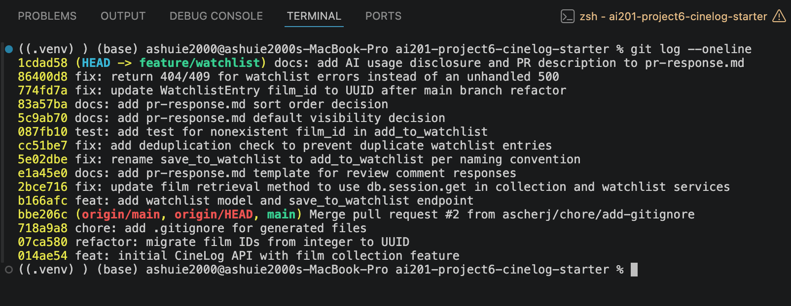

# PR Response Doc — CineLog Watchlist Feature

## AI Usage
I used Claude Code (Anthropic's CLI-based AI coding assistant) as a pair-programming collaborator throughout this PR, directing each step rather than accepting changes wholesale:


- **Orientation:** Had it walk me through `models.py` and `collection_service.py` (responsibilities, function-by-function behavior, cross-file dependencies) before making any changes, so I understood the existing conventions I needed to match.

## Comment 1 — Rename
**What I did:** Renamed `save_to_watchlist()` to `add_to_watchlist()` in `services/watchlist_service.py` so it follows the same `add_to_<noun>` naming convention as `collection_service.add_to_collection()`. Updated the one call site in `routes/watchlist/watchlist.py` (the import and the invocation inside `add_film()`).
**How I verified:** Grepped the whole project for `save_to_watchlist` after the rename to confirm no remaining references to the old name.

## Comment 2 — Deduplication
**What I did:** Added an `AlreadyInWatchlistError` exception and a duplicate check in `add_to_watchlist()` (`services/watchlist_service.py`), mirroring the existing `AlreadyInCollectionError` pattern in `collection_service.add_to_collection()`. Before inserting a new `WatchlistEntry`, the function now queries for an existing `(user_id, film_id)` pair and raises before any write occurs if one is found.
**How I verified:** Manually traced the code path against the `add_to_collection()` reference implementation to confirm the same query-then-raise-before-write order, so no partial/duplicate entry can be committed. 

## Comment 3 — Missing test
**What I did:** Created `tests/test_watchlist.py` with `test_add_to_watchlist_nonexistent_film_raises`, the watchlist equivalent of `test_add_to_collection_nonexistent_film_raises` in `tests/test_collection.py`. It reuses the same `app`/`sample_user` fixture pattern and asserts that calling `add_to_watchlist()` with a nonexistent `film_id` raises `FilmNotFoundError`. Since `Film.id` is still an integer (pre-UUID-refactor) on this branch, the fake id used is an out-of-range integer (`999999`) rather than a UUID string, so the test actually matches the current column type.
**How I verified:** Ran `pytest tests/test_watchlist.py -v` — 1 passed.

## Comment 4 — Default visibility
**My position:** Keep `WatchlistEntry.public` defaulting to `True`.
**Reasoning:** A watchlist is a "here's what I want to watch" signal, not a diary of private behavior the way a viewing history can be — so the default should optimize for the social, low-friction case: friends browsing each other's watchlists to plan a movie night, get recommendations, or piggyback on someone else's queue. If new entries defaulted to private, that value only shows up after a user actively finds and flips a visibility setting most people won't know exists on day one — so the social feature would be dead on arrival for the average user, since almost nothing would be visible for anyone to discover in the first place. Defaulting to public matches the norm in comparable social-logging apps (e.g. Letterboxd), where opt-out privacy is what makes the network effect work.
**Tradeoff acknowledged:** The cost is a real privacy risk: a user could add something they'd rather not have visible (e.g. a film tied to a sensitive topic, or just something they find embarrassing) before they've ever noticed the `public` flag exists, let alone changed it. That's an unintentional-overexposure risk that opt-in visibility wouldn't have. I'd mitigate it at the UX layer rather than by flipping the default — e.g. surfacing the visibility toggle inline on the "add to watchlist" action itself, rather than burying it in a settings page — so the tradeoff is disclosed at the moment it matters instead of being invisible until a user is surprised by it.

## Comment 5 — Sort order
**My position:** Agreed — default the watchlist to date-added order (newest first), not alphabetical.
**Reasoning:** A watchlist behaves more like a queue you're actively adding to than a reference list you browse by name. The moment someone gets the most value from seeing their watchlist is right after adding to it — checking that the add went through, deciding what to watch next out of what's fresh in mind — and recency order serves that moment directly, whereas alphabetical order buries a just-added film wherever its title happens to fall. There's also a consistency argument beyond individual preference: `get_collection()` already sorts by `date_added` descending, so if the watchlist used a different convention, the two views of the app would behave inconsistently for what is conceptually the same kind of list (a chronological log of user activity), which would be a harder habit for users to build a mental model around than either convention alone.
**Engagement with reviewer's point:** The reviewer's claim — "most users want to see what they added recently" — is the stronger default assumption for a watchlist specifically because it's forward-looking (things you intend to do) rather than a catalog to be searched (where alphabetical shines, e.g. scrolling to find one specific title in a long list). I don't think alphabetical order is wrong in general, just that it optimizes for a "look something up" use case this feature doesn't really have yet (no search/filter exists), while recency optimizes for the "what's new / what's next" use case that's core to what a watchlist is for. If a search or filter view gets added later, alphabetical could still make sense there as a secondary sort — but as the single default, I'm siding with the reviewer's recommendation.

## Comment 6 — Rebase
**What conflicted:** Running `git rebase origin/main` produced one textual conflict: an add/add conflict in `.gitignore` (both branches added the file, main's version also included `.pytest_cache/`). More significantly, a *silent* conflict existed with no merge marker: since no commit on `feature/watchlist` touched `models.py` after the branch's first commit, rebasing onto main's already-refactored `models.py` (UUID `Film.id`, from `refactor: migrate film IDs from integer to UUID`) meant the branch simply inherited main's file as-is — which predates the watchlist feature and never contained `WatchlistEntry` at all. The class, along with its `film_id` column (previously `db.Integer`), disappeared entirely from the codebase without git ever flagging it.
**How I resolved it:** Resolved the `.gitignore` conflict as a union of both additions. Then restored the `WatchlistEntry` model in `models.py` with `film_id` typed as `db.String(36)` (matching the new `Film.id` and `CollectionEntry.film_id`), and updated the remaining places that still described `film_id` as an integer: the docstring in `add_to_watchlist()` (`services/watchlist_service.py`), the request-body docstring in `add_film()` (`routes/watchlist/watchlist.py`), and the fake ID used in `test_add_to_watchlist_nonexistent_film_raises` (`tests/test_watchlist.py`), which changed from an out-of-range int to a UUID-shaped string so it actually matches the column type it's testing against.
**How I verified no conflict remains:** Ran `pytest tests/ -v` — all 5 tests passed (both `test_collection.py` and `test_watchlist.py`), and confirmed manually as well. Also ran `git log --merges origin/main..HEAD`, which returned no commits — confirming the rebase kept a linear history with no merge commits introduced on this branch, per the contributing guide's requirement.

## PR Description


**What this feature does:** Adds a watchlist to CineLog — a place for a user to save films they intend to watch, separate from their collection of films already watched. Exposes `GET /watchlist/<user_id>` to view a user's watchlist (sorted newest-added first) and `POST /watchlist/<user_id>/add` to add a film to it, with duplicate-entry protection and a per-entry public/private visibility flag.


**Design decisions:**
- `add_to_watchlist()` follows the codebase's `verb_to_noun` naming convention and mirrors `add_to_collection()`'s structure directly: same nonexistent-film check (`FilmNotFoundError`), same duplicate-entry check pattern (`AlreadyInWatchlistError` alongside the existing `AlreadyInCollectionError`) (Comments 1–2).
- **Default visibility:** `WatchlistEntry.public` defaults to `True` — watchlists are treated as a low-stakes, forward-looking signal worth optimizing for social discovery (e.g. friends browsing each other's queues) rather than defaulting to private; the privacy tradeoff is accepted deliberately and mitigated at the UX layer, not the data layer. Full reasoning in Comment 4 of `pr-response.md`.
- **Sort order:** `get_watchlist()` sorts by `date_added` descending (newest first), matching `get_collection()`'s existing convention, since a watchlist behaves like an active queue rather than a searchable catalog. Full reasoning in Comment 5 of `pr-response.md`.
- `WatchlistEntry.film_id` is a UUID string (`db.String(36)`), matching `Film.id` after main's UUID migration — restored and corrected after a rebase onto `main` silently dropped the model (see Comment 6 of `pr-response.md`).
- `routes/watchlist/watchlist.py`'s `add_film()` now catches `FilmNotFoundError` (→ 404) and `AlreadyInWatchlistError` (→ 409), matching the error-handling pattern already used in `routes/collection.py`, instead of letting those errors surface as an unhandled 500.


**How to manually test:**
1. Install dependencies (`pip install -r requirements.txt`) and run the app.
2. Create a user and a film directly via a Python shell (there's no user-creation endpoint, and `/films` is read-only/seeded per its docstring):
  ```python
  from app import create_app, db
  from models import User, Film
  app = create_app()
  with app.app_context():
     user = User(username="testuser", email="test@example.com")
     film = Film(title="Paddington 2", year=2017)
     db.session.add_all([user, film])
     db.session.commit()
     print(user.id, film.id)
  ```
3. `POST /watchlist/<user_id>/add` with `{"film_id": "<film-uuid>"}` — expect `201` with the new entry as JSON.
4. Repeat the same `POST` — expect `409` (already in watchlist), not a duplicate row.
5. `POST` with a made-up UUID for `film_id` — expect `404` (film not found), not a 500.
6. `GET /watchlist/<user_id>` — expect the added film(s) back, most recently added first.
7. Run the automated suite: `pytest tests/ -v` — all 5 tests should pass.

